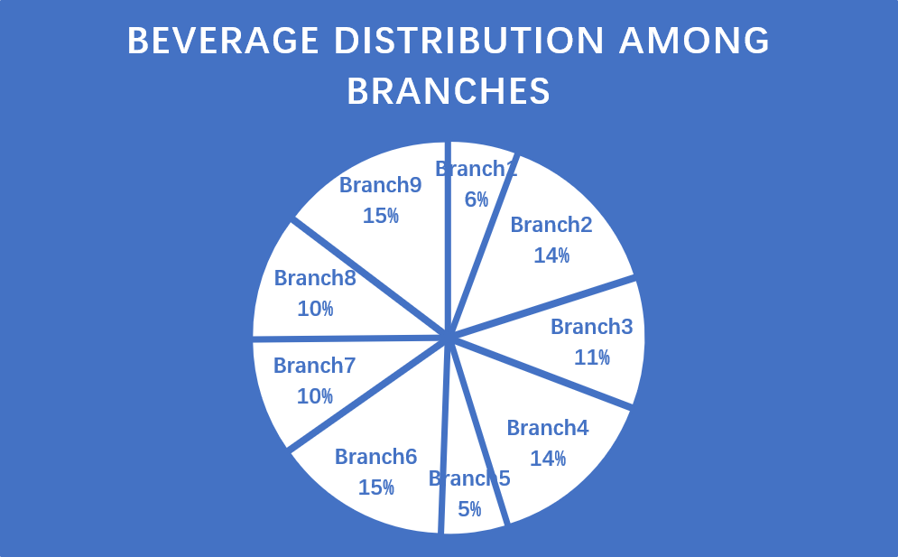

BEVERAGES CONSUMER ANALYSIS

Description:
For this project, I first used python to find patterns in the data. I found that there are patterns existing in not only the Branches data but also in the Consumer Counts data.
More specifically, the consumer counts data are in patterns of XYXY, where X being a block of one "menu" of beverages while Y being another "menu". Within BranchA and ConsumerCountA, for example, the X block beverages repeat for 16 times, and the same goes for Y. One interpretation could be that each block represents one day of sale, and the beverages inside the block represents the beverages sold that day. If this hypothesis is true, then beverages including SMALL_cappuccino, MED_cappuccino, LARGE_cappuccino, COLD_cappuccino, ICY_cappuccino, Triple_cappuccino, Mild_cappuccino are sold daily while other beverages that do not appear on every block are sold every other day. I delved into this pattern in my future query. 

Overview:
This project will let you query into 3 Consumer Counts data for 54 coffee beverages sold across 9 branches. You will be given a menu, from where you can query into the statistics of the beverages and consumer counts, including the most popular beverages on each branch, the common beverages across different branches, and total consumer counts. You'll also be given other options including adding comments and deleting rows.

Programs and tools used:
1. VScode
2. Scala/Spark/Hive
3. Python
